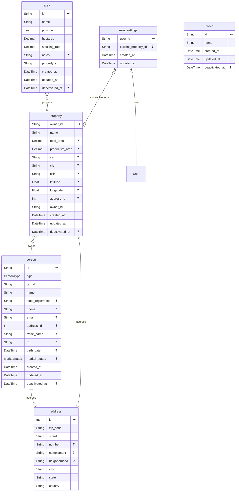

```mermaid
erDiagram

  "address" {
    Int id "🗝️"
    String zip_code 
    String street 
    String number "❓"
    String complement "❓"
    String neighborhood "❓"
    String city 
    String state 
    String country 
    }
  

  "person" {
    String id "🗝️"
    PersonType type 
    String tax_id 
    String name 
    String state_registration "❓"
    String phone "❓"
    String email "❓"
    Int address_id "❓"
    String trade_name "❓"
    String rg "❓"
    DateTime birth_date "❓"
    MaritalStatus marital_status "❓"
    DateTime created_at 
    DateTime updated_at 
    DateTime deactivated_at "❓"
    }
  

  "property" {
    String owner_id "🗝️"
    String name 
    Decimal total_area "❓"
    Decimal productive_area "❓"
    String car "❓"
    String cib "❓"
    String ccir "❓"
    Float latitude "❓"
    Float longitude "❓"
    Int address_id "❓"
    String owner_id 
    DateTime created_at 
    DateTime updated_at 
    DateTime deactivated_at "❓"
    }
  

  "area" {
    String id "🗝️"
    String name 
    Json polygon 
    Decimal hectares 
    Decimal stocking_rate 
    String notes "❓"
    String property_id 
    DateTime created_at 
    DateTime updated_at 
    DateTime deactivated_at "❓"
    }
  

  "user_settings" {
    String user_id "🗝️"
    String current_property_id "❓"
    DateTime created_at 
    DateTime updated_at 
    }
  

  "breed" {
    String id "🗝️"
    String name 
    DateTime created_at 
    DateTime updated_at 
    DateTime deactivated_at "❓"
    }
  
    "person" |o--|o address : "address"
    "property" |o--|o address : "address"
    "property" }o--|| person : "owner"
    "area" }o--|| property : "property"
    "user_settings" |o--|| "User" : "user"
    "user_settings" }o--|o property : "currentProperty"
```
