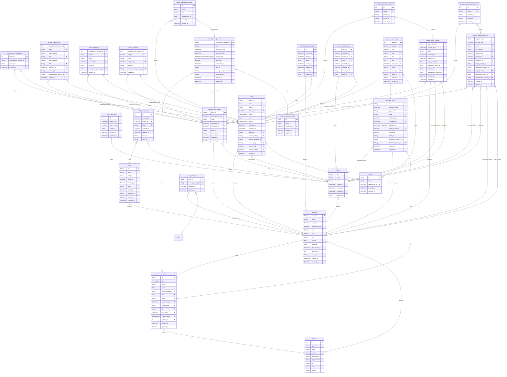

```mermaid
erDiagram

  "property" {
    String owner_id "🗝️"
    String name 
    Decimal total_area "❓"
    Decimal productive_area "❓"
    String car "❓"
    String cib "❓"
    String ccir "❓"
    Float latitude "❓"
    Float longitude "❓"
    DateTime deactivated_at "❓"
    Int address_id "❓"
    String owner_id 
    DateTime created_at 
    DateTime updated_at 
    }
  

  "area" {
    String id "🗝️"
    String name 
    Json polygon 
    Decimal hectares 
    Decimal stocking_rate 
    String notes "❓"
    DateTime closed_at "❓"
    String property_id 
    DateTime created_at 
    DateTime updated_at 
    }
  

  "batch" {
    String id "🗝️"
    String name 
    String notes "❓"
    DateTime closed_at "❓"
    DateTime created_at 
    DateTime updated_at 
    String property_id 
    }
  

  "batch_sale_goal" {
    Int id "🗝️"
    DateTime target_date "❓"
    Decimal target_weight "❓"
    String batch_id 
    DateTime created_at 
    DateTime updated_at 
    }
  

  "batch_area_history" {
    Int id "🗝️"
    DateTime entered_at 
    DateTime exited_at "❓"
    String notes "❓"
    DateTime created_at 
    DateTime updated_at 
    String batch_id 
    String area_id 
    }
  

  "animal" {
    String dam_id "🗝️"
    Int code 
    String name "❓"
    DateTime birth_date "❓"
    AnimalOrigin origin 
    Sex sex 
    AnimalStatus status 
    DateTime created_at 
    DateTime updated_at 
    String breed_id "❓"
    String current_batch_id "❓"
    String current_property_id 
    String current_tag "❓"
    String current_rfid "❓"
    Decimal current_weight "❓"
    Boolean neutered 
    }
  

  "user_settings" {
    String user_id "🗝️"
    String current_property_id "❓"
    DateTime created_at 
    DateTime updated_at 
    }
  

  "person" {
    String id "🗝️"
    PersonType type 
    String tax_id 
    String name 
    String state_registration "❓"
    String phone "❓"
    String email "❓"
    DateTime deactivated_at "❓"
    String trade_name "❓"
    String rg "❓"
    DateTime birth_date "❓"
    MaritalStatus marital_status "❓"
    Int address_id "❓"
    DateTime created_at 
    DateTime updated_at 
    }
  

  "address" {
    Int id "🗝️"
    String zip_code 
    String street 
    String number "❓"
    String complement "❓"
    String neighborhood "❓"
    String city 
    String state 
    String country 
    }
  

  "breed" {
    String id "🗝️"
    String name 
    DateTime deactivated_at "❓"
    DateTime created_at 
    DateTime updated_at 
    }
  

  "management_session" {
    String batch_id "🗝️"
    DateTime management_date 
    String notes "❓"
    DateTime confirmed_at "❓"
    DateTime cancelled_at "❓"
    String batch_id "❓"
    String property_id 
    DateTime created_at 
    DateTime updated_at 
    }
  

  "management_participant" {
    Int batch_id "🗝️"
    String management_session_id 
    String animal_id 
    DateTime created_at 
    }
  

  "animal_identification" {
    Int management_session_id "🗝️"
    String notes "❓"
    Boolean tag_changed 
    String tag "❓"
    Boolean rfid_changed 
    String rfid "❓"
    DateTime identified_at "❓"
    String animal_id 
    String management_session_id "❓"
    DateTime created_at 
    }
  

  "animal_neutering" {
    Int management_session_id "🗝️"
    String method "❓"
    String notes "❓"
    DateTime neutered_at "❓"
    String animal_id 
    String management_session_id "❓"
    DateTime created_at 
    }
  

  "animal_weighing" {
    Int management_session_id "🗝️"
    Decimal weight 
    String notes "❓"
    DateTime weighed_at "❓"
    String animal_id 
    String management_session_id "❓"
    DateTime created_at 
    }
  

  "health_management" {
    String management_session_id "🗝️"
    String title "❓"
    DateTime withdrawal_until "❓"
    DateTime next_due_date "❓"
    HealthManagementPricingType pricing_type "❓"
    Decimal unit_price "❓"
    DateTime performed_at "❓"
    String type_id 
    String management_session_id "❓"
    String veterinarian_id "❓"
    DateTime created_at 
    DateTime updated_at 
    }
  

  "health_management_item" {
    Int id "🗝️"
    String notes "❓"
    Decimal cost "❓"
    String management_id 
    String animal_id 
    DateTime created_at 
    }
  

  "health_management_type" {
    String id "🗝️"
    String name 
    DateTime deactivated_at "❓"
    DateTime created_at 
    DateTime updated_at 
    }
  

  "animal_property_transfer" {
    String origin_batch_id "🗝️"
    DateTime transfer_date 
    String notes "❓"
    String gta_number "❓"
    DateTime confirmed_at "❓"
    DateTime received_at "❓"
    DateTime cancelled_at "❓"
    String origin_property_id 
    String destination_property_id 
    String origin_batch_id "❓"
    String destination_batch_id "❓"
    String management_session_id "❓"
    DateTime created_at 
    DateTime updated_at 
    }
  

  "animal_property_transfer_item" {
    Int id "🗝️"
    String notes "❓"
    String transfer_id 
    String animal_id 
    DateTime created_at 
    }
  

  "animal_property_history" {
    Int id "🗝️"
    DateTime entered_at 
    DateTime exited_at "❓"
    String notes "❓"
    DateTime created_at 
    DateTime updated_at 
    String animal_id 
    String property_id 
    }
  

  "animal_batch_transfer" {
    String origin_batch_id "🗝️"
    DateTime transfer_date 
    String notes "❓"
    DateTime confirmed_at "❓"
    DateTime cancelled_at "❓"
    String origin_batch_id "❓"
    String destination_batch_id 
    String property_id 
    String management_session_id "❓"
    DateTime created_at 
    DateTime updated_at 
    }
  

  "animal_batch_transfer_item" {
    Int id "🗝️"
    String notes "❓"
    String transfer_id 
    String animal_id 
    DateTime created_at 
    }
  

  "animal_batch_history" {
    Int batch_id "🗝️"
    DateTime entered_at 
    DateTime exited_at "❓"
    String notes "❓"
    DateTime created_at 
    DateTime updated_at 
    String animal_id 
    String batch_id "❓"
    }
  

  "purchase_event" {
    String id "🗝️"
    DateTime purchase_date 
    String gta_number "❓"
    String notes "❓"
    DateTime confirmed_at "❓"
    DateTime cancelled_at "❓"
    PurchasePricingType pricing_type 
    Decimal price_per_arroba "❓"
    Decimal total_price "❓"
    String seller_id 
    String destination_property_id 
    String destination_batch_id "❓"
    DateTime created_at 
    DateTime updated_at 
    }
  

  "purchase_event_item" {
    Int animal_id "🗝️"
    Decimal weight "❓"
    Decimal cost "❓"
    String tag "❓"
    String rfid "❓"
    Sex sex "❓"
    DateTime birth_date "❓"
    String notes "❓"
    String breed_id "❓"
    String event_id 
    String animal_id "❓"
    DateTime created_at 
    }
  
    "property" |o--|o address : "address"
    "property" }o--|| person : "owner"
    "area" }o--|| property : "property"
    "batch" }o--|| property : "property"
    "batch_sale_goal" |o--|| batch : "batch"
    "batch_area_history" }o--|| batch : "batch"
    "batch_area_history" }o--|| area : "area"
    "animal" }o--|o breed : "breed"
    "animal" }o--|o batch : "currentBatch"
    "animal" }o--|| property : "currentProperty"
    "user_settings" |o--|| "User" : "user"
    "user_settings" }o--|o property : "currentProperty"
    "person" |o--|o address : "address"
    "management_session" }o--|o batch : "batch"
    "management_session" }o--|| property : "property"
    "management_participant" }o--|| management_session : "managementSession"
    "management_participant" }o--|| animal : "batch_id"
    "animal_identification" }o--|| animal : "animal"
    "animal_identification" }o--|o management_session : "managementSession"
    "animal_neutering" }o--|| animal : "animal"
    "animal_neutering" }o--|o management_session : "managementSession"
    "animal_weighing" }o--|| animal : "animal"
    "animal_weighing" }o--|o management_session : "managementSession"
    "health_management" }o--|| health_management_type : "type"
    "health_management" }o--|o management_session : "managementSession"
    "health_management" }o--|o person : "veterinarian"
    "health_management_item" }o--|| health_management : "management"
    "health_management_item" }o--|| animal : "animal"
    "animal_property_transfer" }o--|| property : "originProperty"
    "animal_property_transfer" }o--|| property : "destinationProperty"
    "animal_property_transfer" }o--|o batch : "originBatch"
    "animal_property_transfer" }o--|o batch : "destinationBatch"
    "animal_property_transfer" }o--|o management_session : "managementSession"
    "animal_property_transfer_item" }o--|| animal_property_transfer : "transfer"
    "animal_property_transfer_item" }o--|| animal : "animal"
    "animal_property_history" }o--|| animal : "animal"
    "animal_property_history" }o--|| property : "property"
    "animal_batch_transfer" }o--|o batch : "originBatch"
    "animal_batch_transfer" }o--|| batch : "destinationBatch"
    "animal_batch_transfer" }o--|| property : "property"
    "animal_batch_transfer" }o--|o management_session : "managementSession"
    "animal_batch_transfer_item" }o--|| animal_batch_transfer : "transfer"
    "animal_batch_transfer_item" }o--|| animal : "animal"
    "animal_batch_history" }o--|| animal : "batch_id"
    "animal_batch_history" }o--|o batch : "batch"
    "purchase_event" }o--|| person : "seller"
    "purchase_event" }o--|| property : "destinationProperty"
    "purchase_event" }o--|o batch : "destinationBatch"
    "purchase_event_item" }o--|o breed : "breed"
    "purchase_event_item" }o--|| purchase_event : "event"
    "purchase_event_item" }o--|o animal : "animal"
```
