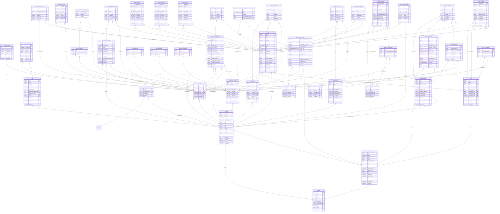

```mermaid
erDiagram

  "property" {
    String owner_id "🗝️"
    String name 
    Decimal total_area "❓"
    Decimal productive_area "❓"
    String car "❓"
    String cib "❓"
    String ccir "❓"
    Float latitude 
    Float longitude 
    String time_zone 
    DateTime deactivated_at "❓"
    Int address_id "❓"
    String owner_id 
    DateTime created_at 
    DateTime updated_at 
    }
  

  "area" {
    String id "🗝️"
    String name 
    Json polygon 
    Decimal hectares 
    Decimal stocking_rate 
    Int default_occupation_days "❓"
    Int default_rest_days "❓"
    String notes "❓"
    DateTime closed_at "❓"
    String property_id 
    DateTime created_at 
    DateTime updated_at 
    }
  

  "batch" {
    String id "🗝️"
    String name 
    String notes "❓"
    DateTime closed_at "❓"
    DateTime created_at 
    DateTime updated_at 
    String property_id 
    }
  

  "batch_sale_goal" {
    Int id "🗝️"
    DateTime target_date "❓"
    Decimal target_weight "❓"
    String batch_id 
    DateTime created_at 
    DateTime updated_at 
    }
  

  "batch_area_history" {
    Int id "🗝️"
    DateTime entered_at 
    DateTime exited_at "❓"
    String notes "❓"
    DateTime created_at 
    DateTime updated_at 
    String batch_id 
    String area_id 
    }
  

  "animal" {
    String dam_id "🗝️"
    Int code 
    String name "❓"
    DateTime birth_date "❓"
    Boolean birth_date_estimated 
    AnimalOrigin origin 
    Sex sex 
    AnimalStatus status 
    DateTime created_at 
    DateTime updated_at 
    String breed_id "❓"
    String current_batch_id "❓"
    String current_property_id 
    String current_brand_id "❓"
    String current_tag "❓"
    String current_rfid "❓"
    Decimal current_weight "❓"
    Boolean neutered 
    }
  

  "user_settings" {
    String user_id "🗝️"
    String current_property_id "❓"
    DateTime created_at 
    DateTime updated_at 
    }
  

  "person" {
    String id "🗝️"
    PersonType type 
    String tax_id 
    String name 
    String state_registration "❓"
    String phone "❓"
    String email "❓"
    DateTime deactivated_at "❓"
    String trade_name "❓"
    String rg "❓"
    DateTime birth_date "❓"
    MaritalStatus marital_status "❓"
    Int address_id "❓"
    DateTime created_at 
    DateTime updated_at 
    }
  

  "address" {
    Int id "🗝️"
    String zip_code 
    String street 
    String number "❓"
    String complement "❓"
    String neighborhood "❓"
    String city 
    String state 
    String country 
    }
  

  "breed" {
    String id "🗝️"
    String name 
    DateTime deactivated_at "❓"
    DateTime created_at 
    DateTime updated_at 
    }
  

  "brand" {
    String id "🗝️"
    String name 
    Bytes image "❓"
    String registration_number "❓"
    String registration_body "❓"
    String registration_city "❓"
    String registration_state "❓"
    DateTime registration_date "❓"
    DateTime deactivated_at "❓"
    String owner_id 
    DateTime created_at 
    DateTime updated_at 
    }
  

  "management_session" {
    String id "🗝️"
    String title 
    String notes "❓"
    DateTime scheduled_at 
    DateTime performed_at "❓"
    DateTime confirmed_at "❓"
    DateTime cancelled_at "❓"
    String property_id 
    DateTime created_at 
    DateTime updated_at 
    }
  

  "management_step" {
    Int id "🗝️"
    ManagementStepType type 
    Int position 
    String management_session_id 
    String health_management_id "❓"
    }
  

  "management_participant" {
    Int batch_id "🗝️"
    String management_session_id 
    String animal_id 
    Boolean batch_kept 
    DateTime last_handled_at "❓"
    DateTime created_at 
    }
  

  "tag_management" {
    String id "🗝️"
    String management_session_id 
    DateTime created_at 
    }
  

  "animal_tagging" {
    Int management_id "🗝️"
    String tag "❓"
    String notes "❓"
    DateTime identified_at 
    String original_tag "❓"
    DateTime corrected_at "❓"
    DateTime cancelled_at "❓"
    String management_id "❓"
    String animal_id 
    DateTime created_at 
    }
  

  "rfid_management" {
    String id "🗝️"
    String management_session_id 
    DateTime created_at 
    }
  

  "animal_rfid_tagging" {
    Int original_rfid "🗝️"
    String rfid "❓"
    String notes "❓"
    DateTime identified_at 
    String original_rfid "❓"
    DateTime corrected_at "❓"
    DateTime cancelled_at "❓"
    String management_id "❓"
    String animal_id 
    DateTime created_at 
    }
  

  "neutering_management" {
    String id "🗝️"
    String suggested_technique_id "❓"
    String management_session_id 
    DateTime created_at 
    }
  

  "animal_neutering" {
    Int management_id "🗝️"
    String notes "❓"
    String technique_id "❓"
    DateTime neutered_at 
    DateTime original_neutered_at "❓"
    String original_technique_id "❓"
    DateTime corrected_at "❓"
    DateTime cancelled_at "❓"
    String management_id "❓"
    String animal_id 
    DateTime created_at 
    }
  

  "neutering_technique" {
    String id "🗝️"
    String name 
    DateTime deactivated_at "❓"
    DateTime created_at 
    DateTime updated_at 
    }
  

  "weighing_management" {
    String id "🗝️"
    String management_session_id 
    DateTime created_at 
    }
  

  "animal_weighing" {
    Int management_id "🗝️"
    Decimal weight 
    String notes "❓"
    DateTime weighed_at 
    Decimal original_weight "❓"
    DateTime corrected_at "❓"
    DateTime cancelled_at "❓"
    String management_id "❓"
    String animal_id 
    DateTime created_at 
    }
  

  "brand_management" {
    String id "🗝️"
    String suggested_brand_id "❓"
    String management_session_id 
    DateTime created_at 
    }
  

  "animal_branding" {
    Int management_id "🗝️"
    String notes "❓"
    DateTime branded_at 
    String brand_id 
    DateTime original_branded_at "❓"
    String original_brand_id "❓"
    DateTime corrected_at "❓"
    DateTime cancelled_at "❓"
    String management_id "❓"
    String animal_id 
    DateTime created_at 
    }
  

  "batch_management" {
    String id "🗝️"
    String management_session_id 
    DateTime created_at 
    }
  

  "batch_management_suggestion" {
    String management_id 
    String batch_id 
    Int position 
    }
  

  "health_management" {
    String management_session_id "🗝️"
    String title "❓"
    DateTime withdrawal_end_date "❓"
    DateTime next_due_date "❓"
    HealthManagementDoseType dose_type 
    Decimal dose_ml "❓"
    Decimal dose_weight_kg "❓"
    DateTime performed_at 
    String type_id 
    String management_session_id "❓"
    String veterinarian_id "❓"
    DateTime created_at 
    DateTime updated_at 
    }
  

  "health_management_item" {
    Int id "🗝️"
    String notes "❓"
    Decimal dose_ml "❓"
    String management_id 
    String animal_id 
    DateTime created_at 
    }
  

  "health_management_type" {
    String id "🗝️"
    String name 
    DateTime deactivated_at "❓"
    DateTime created_at 
    DateTime updated_at 
    }
  

  "animal_property_transfer" {
    String origin_batch_id "🗝️"
    DateTime transferred_at 
    String notes "❓"
    String gta_number "❓"
    DateTime confirmed_at "❓"
    DateTime received_at "❓"
    DateTime cancelled_at "❓"
    String origin_property_id 
    String destination_property_id 
    String origin_batch_id "❓"
    String destination_batch_id "❓"
    String management_session_id "❓"
    DateTime created_at 
    DateTime updated_at 
    }
  

  "animal_property_transfer_item" {
    Int id "🗝️"
    String notes "❓"
    String transfer_id 
    String animal_id 
    DateTime created_at 
    }
  

  "animal_property_history" {
    Int id "🗝️"
    DateTime entered_at 
    DateTime exited_at "❓"
    String notes "❓"
    DateTime created_at 
    DateTime updated_at 
    String animal_id 
    String property_id 
    }
  

  "animal_batch_transfer" {
    String management_session_id "🗝️"
    DateTime transferred_at 
    String notes "❓"
    DateTime confirmed_at "❓"
    DateTime cancelled_at "❓"
    String destination_batch_id 
    String property_id 
    String management_session_id "❓"
    DateTime created_at 
    DateTime updated_at 
    }
  

  "animal_batch_transfer_item" {
    Int id "🗝️"
    String notes "❓"
    String transfer_id 
    String animal_id 
    String origin_batch_id "❓"
    DateTime created_at 
    }
  

  "animal_batch_history" {
    Int batch_id "🗝️"
    DateTime entered_at 
    DateTime exited_at "❓"
    String notes "❓"
    DateTime created_at 
    DateTime updated_at 
    String animal_id 
    String batch_id "❓"
    }
  

  "purchase_event" {
    String id "🗝️"
    String title 
    DateTime purchase_date 
    String notes "❓"
    DateTime payment_date "❓"
    String payment_reference "❓"
    DateTime confirmed_at "❓"
    DateTime cancelled_at "❓"
    String seller_id 
    String destination_property_id 
    DateTime created_at 
    DateTime updated_at 
    }
  

  "purchase_category" {
    Int id "🗝️"
    Sex sex 
    Int min_age_months "❓"
    Int max_age_months "❓"
    Int expected_quantity 
    String notes "❓"
    PurchasePricingType pricing_type 
    Decimal unit_price "❓"
    Decimal total_price "❓"
    Decimal invoiced_weight "❓"
    Decimal shrink_percent "❓"
    PurchaseCostSplit cost_split 
    String breed_id "❓"
    String event_id 
    }
  

  "purchase_reception" {
    String id "🗝️"
    String purchase_event_id 
    String management_session_id 
    String entry_batch_id 
    String gta_number "❓"
    String invoice_number "❓"
    DateTime created_at 
    }
  

  "purchased_animal" {
    Int id "🗝️"
    Decimal cost "❓"
    String purchase_event_id 
    Int category_id 
    String reception_id 
    String animal_id 
    DateTime created_at 
    }
  

  "loss_event" {
    String id "🗝️"
    String title 
    String description "❓"
    DateTime occurred_at 
    DateTime confirmed_at "❓"
    DateTime cancelled_at "❓"
    String property_id 
    DateTime created_at 
    DateTime updated_at 
    }
  

  "loss_event_item" {
    Int id "🗝️"
    AnimalLossType type 
    String notes "❓"
    String event_id 
    String animal_id 
    String origin_batch_id "❓"
    DateTime created_at 
    }
  

  "slaughter_event" {
    String id "🗝️"
    String title 
    String description "❓"
    DateTime scheduled_at 
    DateTime slaughtered_at "❓"
    DateTime confirmed_at "❓"
    DateTime cancelled_at "❓"
    String property_id 
    DateTime created_at 
    DateTime updated_at 
    }
  

  "slaughter_event_item" {
    Int id "🗝️"
    String notes "❓"
    String event_id 
    String animal_id 
    String origin_batch_id "❓"
    DateTime created_at 
    }
  
    "property" |o--|o address : "address"
    "property" }o--|| person : "owner"
    "area" }o--|| property : "property"
    "batch" }o--|| property : "property"
    "batch_sale_goal" |o--|| batch : "batch"
    "batch_area_history" }o--|| batch : "batch"
    "batch_area_history" }o--|| area : "area"
    "animal" }o--|o breed : "breed"
    "animal" }o--|o batch : "currentBatch"
    "animal" }o--|| property : "currentProperty"
    "animal" }o--|o brand : "currentBrand"
    "user_settings" |o--|| "User" : "user"
    "user_settings" }o--|o property : "currentProperty"
    "person" |o--|o address : "address"
    "brand" }o--|| person : "owner"
    "management_session" }o--|| property : "property"
    "management_step" }o--|| management_session : "managementSession"
    "management_step" |o--|o health_management : "healthManagement"
    "management_participant" }o--|| management_session : "managementSession"
    "management_participant" }o--|| animal : "batch_id"
    "tag_management" |o--|| management_session : "managementSession"
    "animal_tagging" }o--|o tag_management : "management"
    "animal_tagging" }o--|| animal : "animal"
    "rfid_management" |o--|| management_session : "managementSession"
    "animal_rfid_tagging" }o--|o rfid_management : "management"
    "animal_rfid_tagging" }o--|| animal : "animal"
    "neutering_management" }o--|o neutering_technique : "suggestedTechnique"
    "neutering_management" |o--|| management_session : "managementSession"
    "animal_neutering" }o--|o neutering_technique : "technique"
    "animal_neutering" }o--|o neutering_technique : "originalTechnique"
    "animal_neutering" }o--|o neutering_management : "management"
    "animal_neutering" }o--|| animal : "animal"
    "weighing_management" |o--|| management_session : "managementSession"
    "animal_weighing" }o--|o weighing_management : "management"
    "animal_weighing" }o--|| animal : "animal"
    "brand_management" }o--|o brand : "suggestedBrand"
    "brand_management" |o--|| management_session : "managementSession"
    "animal_branding" }o--|| brand : "brand"
    "animal_branding" }o--|o brand : "originalBrand"
    "animal_branding" }o--|o brand_management : "management"
    "animal_branding" }o--|| animal : "animal"
    "batch_management" |o--|| management_session : "managementSession"
    "batch_management_suggestion" }o--|| batch_management : "management"
    "batch_management_suggestion" }o--|| batch : "batch"
    "health_management" }o--|| health_management_type : "type"
    "health_management" }o--|o management_session : "managementSession"
    "health_management" }o--|o person : "veterinarian"
    "health_management_item" }o--|| health_management : "management"
    "health_management_item" }o--|| animal : "dose_ml"
    "animal_property_transfer" }o--|| property : "originProperty"
    "animal_property_transfer" }o--|| property : "destinationProperty"
    "animal_property_transfer" }o--|o batch : "originBatch"
    "animal_property_transfer" }o--|o batch : "destinationBatch"
    "animal_property_transfer" }o--|o management_session : "managementSession"
    "animal_property_transfer_item" }o--|| animal_property_transfer : "transfer"
    "animal_property_transfer_item" }o--|| animal : "animal"
    "animal_property_history" }o--|| animal : "animal"
    "animal_property_history" }o--|| property : "property"
    "animal_batch_transfer" }o--|| batch : "destinationBatch"
    "animal_batch_transfer" }o--|| property : "property"
    "animal_batch_transfer" }o--|o management_session : "managementSession"
    "animal_batch_transfer_item" }o--|| animal_batch_transfer : "transfer"
    "animal_batch_transfer_item" }o--|| animal : "animal"
    "animal_batch_transfer_item" }o--|o batch : "originBatch"
    "animal_batch_history" }o--|| animal : "batch_id"
    "animal_batch_history" }o--|o batch : "batch"
    "purchase_event" }o--|| person : "seller"
    "purchase_event" }o--|| property : "destinationProperty"
    "purchase_category" }o--|o breed : "breed"
    "purchase_category" }o--|| purchase_event : "event"
    "purchase_reception" }o--|| purchase_event : "purchaseEvent"
    "purchase_reception" |o--|| management_session : "managementSession"
    "purchase_reception" }o--|| batch : "entryBatch"
    "purchased_animal" }o--|| purchase_event : "purchaseEvent"
    "purchased_animal" }o--|| purchase_category : "category"
    "purchased_animal" }o--|| purchase_reception : "reception"
    "purchased_animal" }o--|| animal : "animal"
    "loss_event" }o--|| property : "property"
    "loss_event_item" }o--|| loss_event : "event"
    "loss_event_item" }o--|| animal : "animal"
    "loss_event_item" }o--|o batch : "originBatch"
    "slaughter_event" }o--|| property : "property"
    "slaughter_event_item" }o--|| slaughter_event : "event"
    "slaughter_event_item" }o--|| animal : "animal"
    "slaughter_event_item" }o--|o batch : "originBatch"
```
