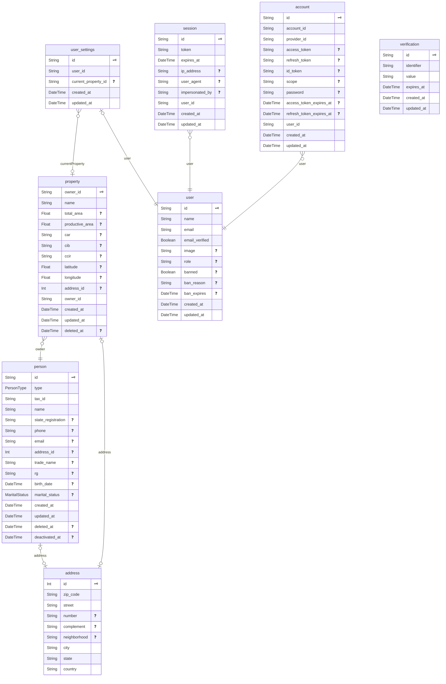

```mermaid
erDiagram

  "address" {
    Int id "🗝️"
    String zip_code 
    String street 
    String number "❓"
    String complement "❓"
    String neighborhood "❓"
    String city 
    String state 
    String country 
    }
  

  "person" {
    String id "🗝️"
    PersonType type 
    String tax_id 
    String name 
    String state_registration "❓"
    String phone "❓"
    String email "❓"
    Int address_id "❓"
    String trade_name "❓"
    String rg "❓"
    DateTime birth_date "❓"
    MaritalStatus marital_status "❓"
    DateTime created_at 
    DateTime updated_at 
    DateTime deleted_at "❓"
    DateTime deactivated_at "❓"
    }
  

  "property" {
    String owner_id "🗝️"
    String name 
    Float total_area "❓"
    Float productive_area "❓"
    String car "❓"
    String cib "❓"
    String ccir "❓"
    Float latitude "❓"
    Float longitude "❓"
    Int address_id "❓"
    String owner_id 
    DateTime created_at 
    DateTime updated_at 
    DateTime deleted_at "❓"
    }
  

  "user_settings" {
    String id "🗝️"
    String user_id 
    String current_property_id "❓"
    DateTime created_at 
    DateTime updated_at 
    }
  

  "user" {
    String id "🗝️"
    String name 
    String email 
    Boolean email_verified 
    String image "❓"
    String role "❓"
    Boolean banned "❓"
    String ban_reason "❓"
    DateTime ban_expires "❓"
    DateTime created_at 
    DateTime updated_at 
    }
  

  "session" {
    String id "🗝️"
    String token 
    DateTime expires_at 
    String ip_address "❓"
    String user_agent "❓"
    String impersonated_by "❓"
    String user_id 
    DateTime created_at 
    DateTime updated_at 
    }
  

  "account" {
    String id "🗝️"
    String account_id 
    String provider_id 
    String access_token "❓"
    String refresh_token "❓"
    String id_token "❓"
    String scope "❓"
    String password "❓"
    DateTime access_token_expires_at "❓"
    DateTime refresh_token_expires_at "❓"
    String user_id 
    DateTime created_at 
    DateTime updated_at 
    }
  

  "verification" {
    String id "🗝️"
    String identifier 
    String value 
    DateTime expires_at 
    DateTime created_at 
    DateTime updated_at 
    }
  
    "person" |o--|o address : "address"
    "property" |o--|o address : "address"
    "property" }o--|| person : "owner"
    "user_settings" |o--|| user : "user"
    "user_settings" }o--|o property : "currentProperty"
    "session" }o--|| user : "user"
    "account" }o--|| user : "user"
```
